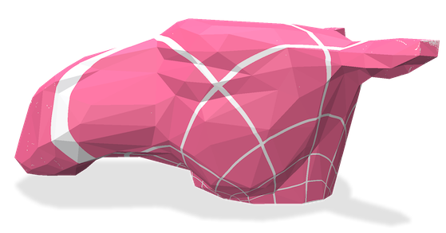
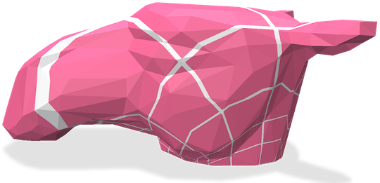

# BPM: Blended Piecewise M&ouml;bius Maps
Polyscope implementation of [BPM: Blended Piecewise Moebius Maps](https://arxiv.org/pdf/2306.12792.pdf) by Rorberg, Vaxman & Ben-Chen.
The code takes in a mesh with disk topology, flattens it with [BFF](https://geometrycollective.github.io/boundary-first-flattening/), and shows the parameterization with either blended M&ouml;bius interpolation, or piecewise-linear interpolation.

|||
|:----:|:-----:|
|BPM interpolation|Piecewise-linear interpolation|

## Building
This repo is set up as a template, but it seems the submodules don't get copied to the new project. Run `setup.sh` to set up the required submodules and to run cmake. Setup also sets up cmake to export compile commands for `clang-format`. To build the code, you can run
```
cd build
make -j7
```

Then run the code with
```
bin/run /path/to/a/mesh
```

Run the tests with
```
bin/test
```
